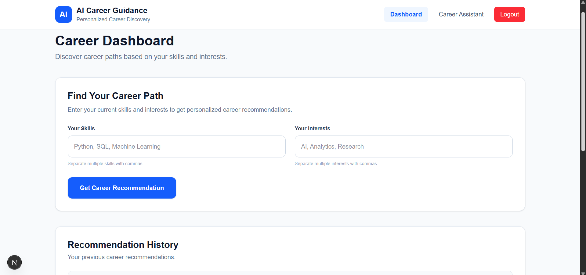
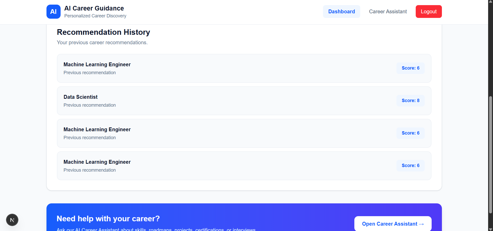
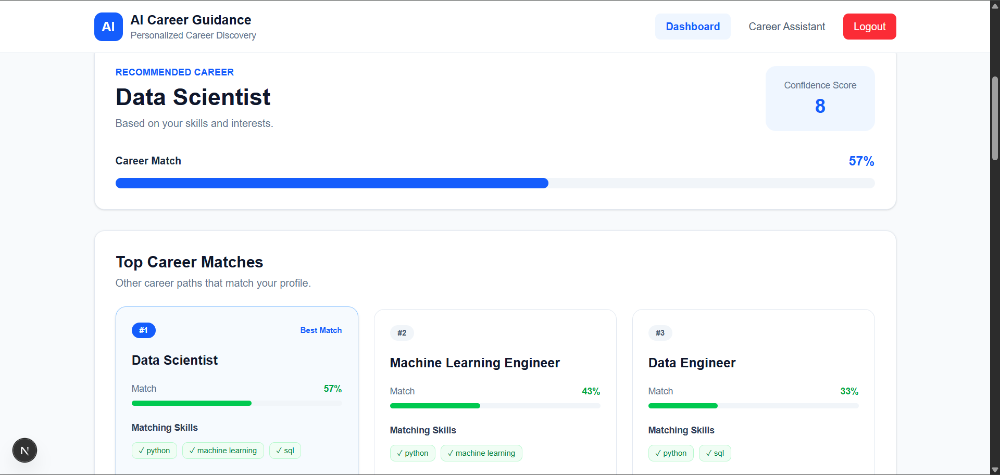
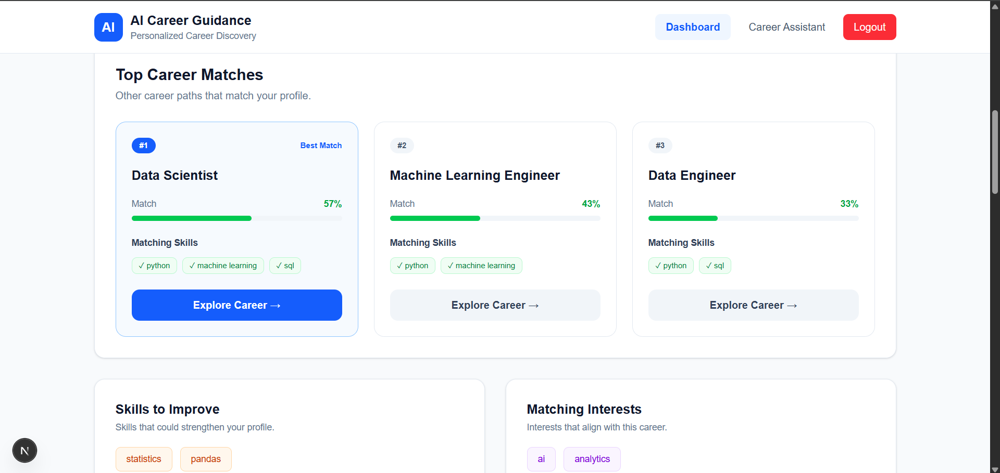
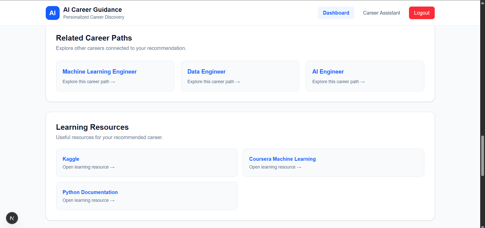
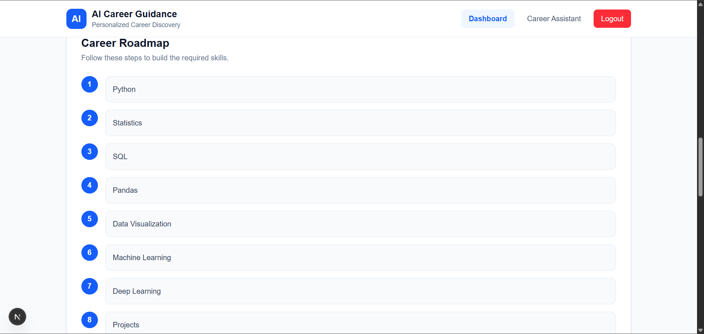
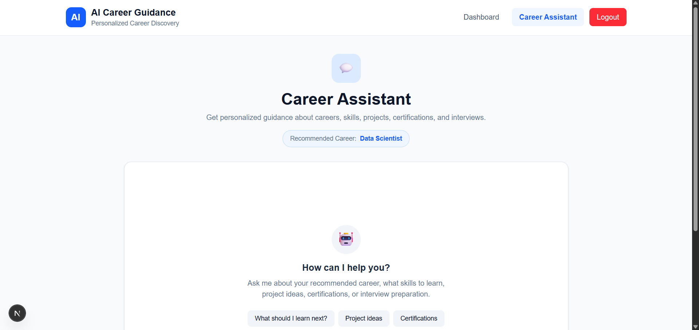

# 🤖 AI Career Guidance Platform

An AI-powered full-stack career guidance platform that helps students discover suitable career paths based on their skills and interests.

The platform combines a **FastAPI backend, Next.js frontend, career recommendation engine, database-backed recommendation history, and an AI-powered career assistant** into one full-stack application.

---

## 🚀 Features

### 🎯 AI Career Recommendation

* Takes user skills and interests as input.
* Compares them against multiple career profiles.
* Provides a personalized career recommendation.
* Displays a career match percentage.
* Shows the top 3 matching career paths.

### 📊 Skill Analysis

* Shows skills that already match the selected career.
* Identifies missing skills that the user should improve.
* Displays matching interests.

### 🗺️ Career Roadmap

* Provides a structured learning roadmap for the recommended career.
* Helps beginners understand what to learn step by step.

### 🔗 Learning Resources

* Provides useful learning resources related to the recommended career.
* Helps users continue learning after receiving their recommendation.

### 🔄 Related Career Paths

* Shows other career options related to the recommended career.
* Allows users to explore alternative career paths.

### 📚 Recommendation History

* Stores previous career recommendations.
* Allows users to view their recommendation history.
* Recommendations are associated with individual user accounts.

### 💬 AI Career Assistant

* Separate AI-powered career assistant page.
* Uses the user's recommended career as context.
* Provides personalized guidance about:

  * Career skills
  * Learning paths
  * Projects
  * Certifications
  * Interview preparation
  * Programming and technology skills

### 🔐 Authentication

* User registration and login.
* User-specific recommendation history.
* Logout functionality.

### 📱 Responsive Web Interface

* Clean and modern light-themed interface.
* Dashboard for career recommendations.
* Separate Career Assistant page.

---

## 📸 Application Screenshots

### 🏠 Career Dashboard





---

### 🎯 Career Recommendation









---

### 💬 AI Career Assistant



---

## 🏗️ System Architecture

```text
                    ┌─────────────────────────┐
                    │         User            │
                    └────────────┬────────────┘
                                 │
                                 ▼
                    ┌─────────────────────────┐
                    │    Next.js Frontend     │
                    │   React + TypeScript    │
                    │      Tailwind CSS       │
                    └────────────┬────────────┘
                                 │
                            REST API
                                 │
                                 ▼
                    ┌─────────────────────────┐
                    │     FastAPI Backend     │
                    │    Python + Uvicorn     │
                    └────────────┬────────────┘
                                 │
              ┌──────────────────┼──────────────────┐
              │                  │                  │
              ▼                  ▼                  ▼
     ┌────────────────┐ ┌────────────────┐ ┌────────────────┐
     │ Career         │ │ Authentication │ │ AI Career      │
     │ Recommendation │ │                │ │ Assistant      │
     │ Engine         │ │                │ │ OpenAI API     │
     └────────────────┘ └────────────────┘ └────────────────┘
              │                  │                  │
              └──────────────────┼──────────────────┘
                                 ▼
                    ┌─────────────────────────┐
                    │ SQLite + SQLAlchemy     │
                    │ User & Recommendation   │
                    │ History                 │
                    └─────────────────────────┘
```

---

## 🛠️ Tech Stack

### Frontend

* Next.js
* React
* TypeScript
* Tailwind CSS

### Backend

* Python
* FastAPI
* Uvicorn
* Pydantic

### Database

* SQLite
* SQLAlchemy

### AI

* OpenAI API

### Development Tools

* Visual Studio Code
* Git
* GitHub
* Swagger UI

---

## 📁 Project Structure

```text
ai-career-guidance/
│
├── backend/
│   ├── models/
│   ├── routes/
│   ├── services/
│   ├── database.py
│   ├── main.py
│   ├── career.db
│   └── .env
│
├── frontend/
│   ├── app/
│   │   ├── dashboard/
│   │   │   ├── page.tsx
│   │   │   └── chat/
│   │   │       └── page.tsx
│   │   └── login/
│   │
│   ├── components/
│   ├── hooks/
│   ├── lib/
│   ├── services/
│   └── types/
│
├── screenshots/
│   ├── dashboard1.png
│   ├── dashboard2.png
│   ├── recommended.png
│   ├── recommended1.png
│   ├── recommended2.png
│   ├── recommended3.png
│   ├── recommended4.png
│   └── career-assistant.png
│
├── .gitignore
└── README.md
```

---

## ⚙️ How It Works

### 1. User Registration

The user creates an account using the registration page.

### 2. User Login

The user logs into the platform and is redirected to the dashboard.

### 3. Enter Skills and Interests

The user provides their current technical skills and career interests.

### 4. Career Recommendation

The backend recommendation engine compares the user's inputs with predefined career profiles.

The system calculates matching skills and interests and generates career matches.

### 5. View Results

The dashboard displays:

* Recommended career
* Match percentage
* Confidence score
* Matching skills
* Missing skills
* Top career matches
* Career roadmap
* Related careers
* Learning resources

### 6. Recommendation History

The recommendation is stored in the database so the user can access previous recommendations.

### 7. AI Career Assistant

The user can open the Career Assistant and ask career-related questions.

The recommended career is passed to the AI assistant as context so that responses can be tailored to the user's career path.

---

## 🧠 Career Recommendation Logic

The recommendation engine compares user input against career profiles containing:

* Required skills
* Interests
* Career roadmap
* Learning resources
* Related careers

Skills receive higher weight than interests when calculating the career match.

The system evaluates multiple careers and returns the best match along with the top alternative career paths.

---

## 🔑 Environment Variables

The backend uses an environment variable for the OpenAI API key.

Create a `.env` file inside the `backend` folder:

```env
OPENAI_API_KEY=your_openai_api_key
```

**Never commit your API key to GitHub.**

The `.env` file should remain ignored by Git.

---

## ▶️ Running the Project Locally

### Backend

Open a terminal and navigate to:

```powershell
cd ai-career-guidance\backend
```

Activate the virtual environment:

```powershell
.\venv\Scripts\activate
```

Start the FastAPI server:

```powershell
uvicorn main:app --reload
```

Backend:

```text
http://127.0.0.1:8000
```

Swagger API documentation:

```text
http://127.0.0.1:8000/docs
```

---

### Frontend

Open another terminal:

```powershell
cd ai-career-guidance\frontend
```

Start the development server:

```powershell
npm run dev
```

Frontend:

```text
http://localhost:3000
```

---

## 🔄 Application Flow

```text
Register
   ↓
Login
   ↓
Dashboard
   ↓
Enter Skills + Interests
   ↓
Career Recommendation Engine
   ↓
Recommended Career
   ↓
 ┌───────────────────────┐
 │ Match Analysis        │
 │ Skill Gaps            │
 │ Top Career Matches    │
 │ Career Roadmap        │
 │ Resources             │
 │ Related Careers       │
 └───────────────────────┘
   ↓
Recommendation History
   ↓
AI Career Assistant
```

---

## 🔮 Future Improvements

* Resume upload and resume analysis.
* Resume-based career recommendations.
* More advanced AI career matching.
* Personalized weekly learning plans.
* Job and internship recommendations.
* Integration with job platforms.
* More career profiles and learning resources.
* Progress tracking for career roadmaps.
* AI-powered mock interviews.
* Skill assessment tests.
* Improved recommendation algorithms using machine learning.

---

## 🎓 Project Purpose

This project was developed as a full-stack and Generative AI project to explore how AI can be used to provide personalized career guidance to students and beginners.

It combines:

* Full-stack web development
* REST APIs
* Database management
* Authentication
* Recommendation systems
* Generative AI
* Personalized user experiences

---

## 👨‍💻 Author

**Shashanka**

B.Tech CSE Student

---

## 📌 Repository

GitHub:

`https://github.com/Shashanka16/ai-career-guidance.git`

---

## ⚠️ Security Note

API keys, passwords, environment files, database files, and other sensitive information should not be committed to the public repository.

Use environment variables for secret credentials.
